# Azure Cognitive Services を活用した Xamarin によるマルチプラットフォームアプリ開発 ハンズオン

## 1. “人工知能パーツ” Cognitive Services 概要 & はじめて触ってみるハンズオン

このセクションでは Azure Cognitive Services を利用したデモサイトに触れ、Cognitive Services の 各 API の動作を確認します。  

### 1-2. API レファレンス および Postman から Cognitive Services の API の動作を確認する

[Postman](https://www.getpostman.com/) (<https://www.getpostman.com/>) は、各種 Web API にリクエスト(GET, POST, ...) を送信して、その結果を取得できるツールです。

このセクションでは、Postman 経由で Cognitive Services の Face API にアクセスして、結果を取得して動作を確認します。

#### 事前準備

- Microsoft アカウント
    - 次の Cognitive Services サブスクリプションの申し込みに必要となりますので、持っていない場合は以下から取得しておきます。
    >[Microsoft アカウント登録手続き](https://www.microsoft.com/ja-jp/msaccount/signup/default.aspx)
- Cognitive Services Face API のサブスクリプション
    - 以下の手順で Face API の無料試用サブスクリプションに申込を行います。
    >[Cognitive Services の無料サブスクリプションの申し込み方法](https://github.com/ayako/AAJP-EmotionBotHoL/blob/master/CognitiveSubscriptionTrial.md#1-30日間無料版の申し込み方法)
  

#### API レファレンスからの Face API (Detect) の動作確認

1. ブラウザーで [Cognitive Services の Web サイト](https://azure.microsoft.com/ja-jp/services/cognitive-services/) (<http://microsoft.com/cognitive>) を開きます。**視覚** をクリックし、**視覚** グループのページで **Face** をクリックして開きます。

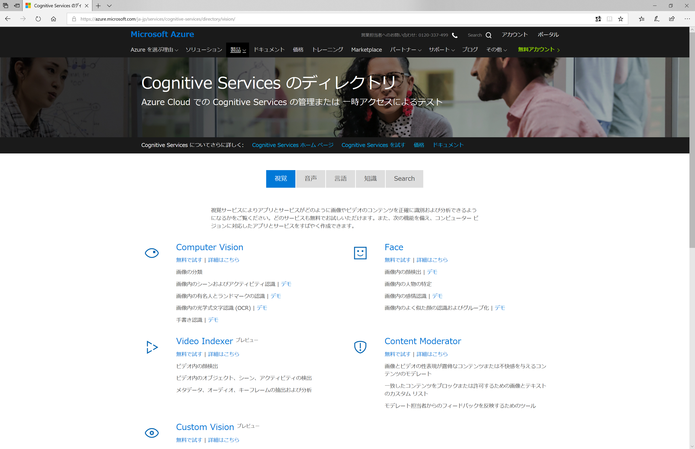  

2. **API リファレンス** をクリックして、Face API のリファレンスを開きます。

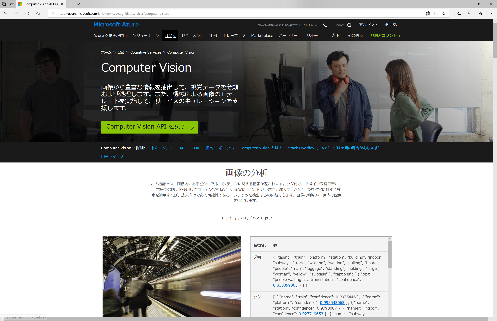  

3. **Face API API Reference** が表示されたら、**Face > Detect** が選択されていることを確認します。

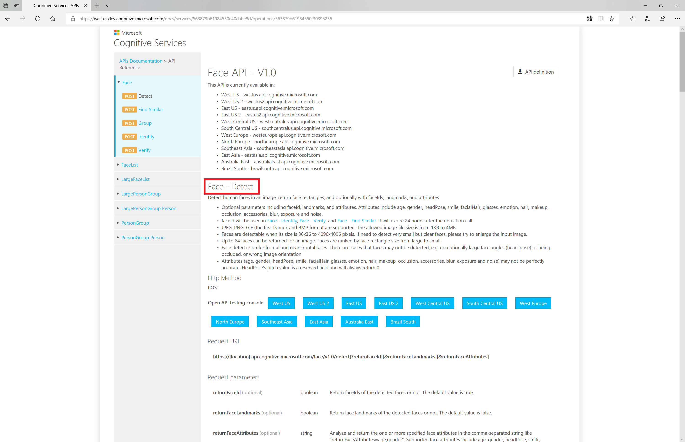  


4. サブスクリプションで指定されたロケーションを選択してクリックします。

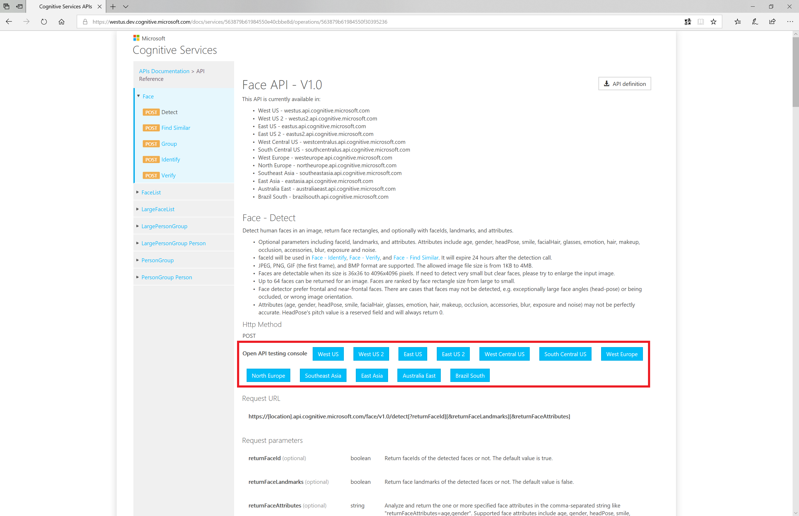  

>**ロケーション** は、Cognitive Services の無料試用サブスクリプションに申込を行った際に表示された **エンドポイント** で判別します。
以下の例だと、ロケーションは **westcentralus** (West Central US) になります。
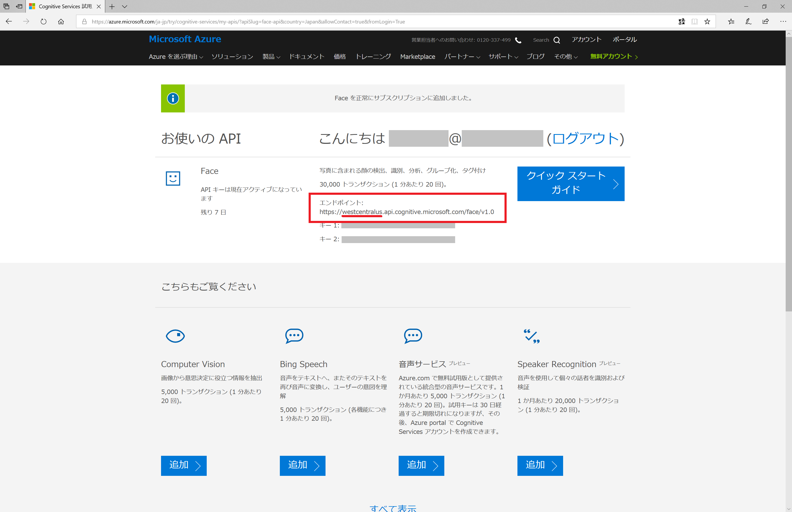  


5. API の動作確認画面が表示されます。各パラメーターには以下の値を入力します。この情報は次のセクションで利用しますので、ローカルに保存しておきます。
    - Query parameters
        - returnFaceId : False
        - returnFaceLandmarks : False
        - returnFaceAttributes : age,gender,emotion
    - Headers
        - Content-Type : application/json
        - Ocp-Apim-Subscription-Key : Face API キー
    - Request Body
        ```
        {
            "url": "https://how-old.net/images/faces2/main007.jpg"
        }
        ```

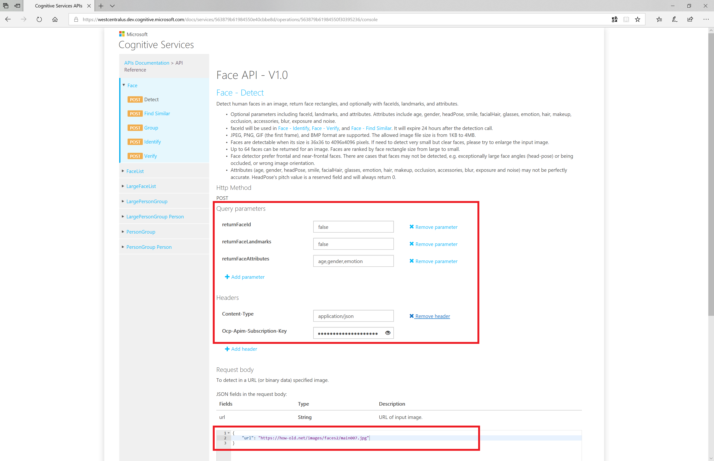  

>**Face API キー** は、Cognitive Services の無料試用サブスクリプションに申込して取得した **キー1** になります。
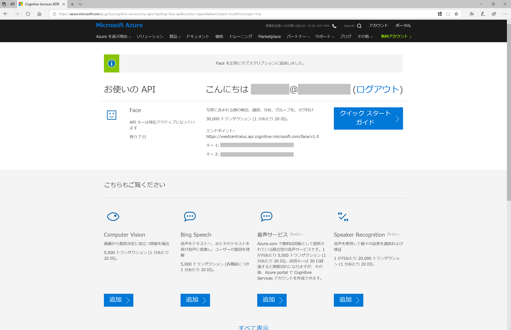  

6. 画面をスクロールします。入力した内容に基づいて、以下のように API の Request URL および API への送信内容が生成されます。この Request URL の情報は次のセクションで利用しますので、ローカルに保存しておきます。

> API の Request URL
**Request URL**
```
https://westcentralus.api.cognitive.microsoft.com/face/v1.0/detect?returnFaceId=false&returnFaceLandmarks=false&returnFaceAttributes=age,gender,emotion
```

> API への送信内容
**HTTP request**
```
POST https://westcentralus.api.cognitive.microsoft.com/face/v1.0/detect?returnFaceId=false&returnFaceLandmarks=false&returnFaceAttributes=age,gender,emotion HTTP/1.1
Host: westcentralus.api.cognitive.microsoft.com
Content-Type: application/json
Ocp-Apim-Subscription-Key: ••••••••••••••••••••••••••••••••
{
    "url": "https://how-old.net/images/faces2/main007.jpg"
}
```

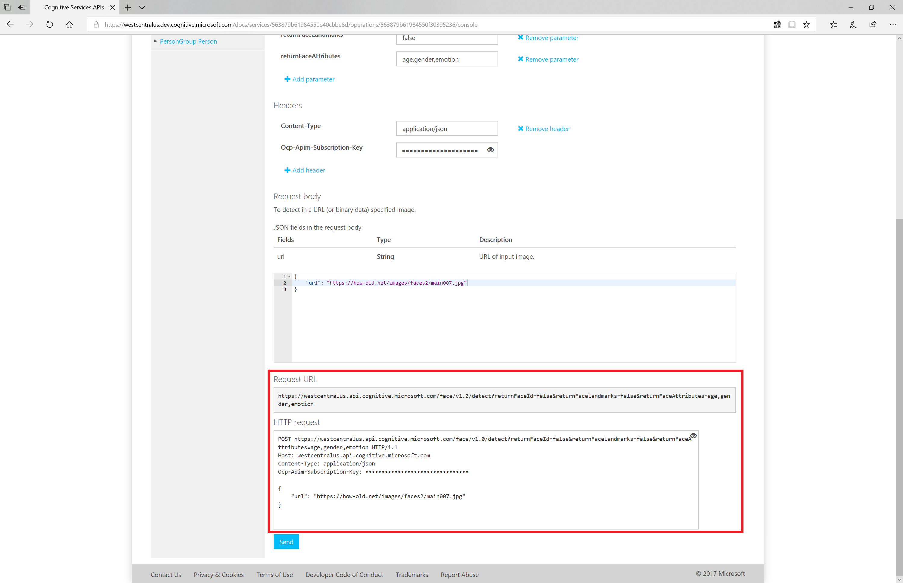  

7. [**Send**] をクリックすると、リクエストが送信され、その結果が下に表示されます。

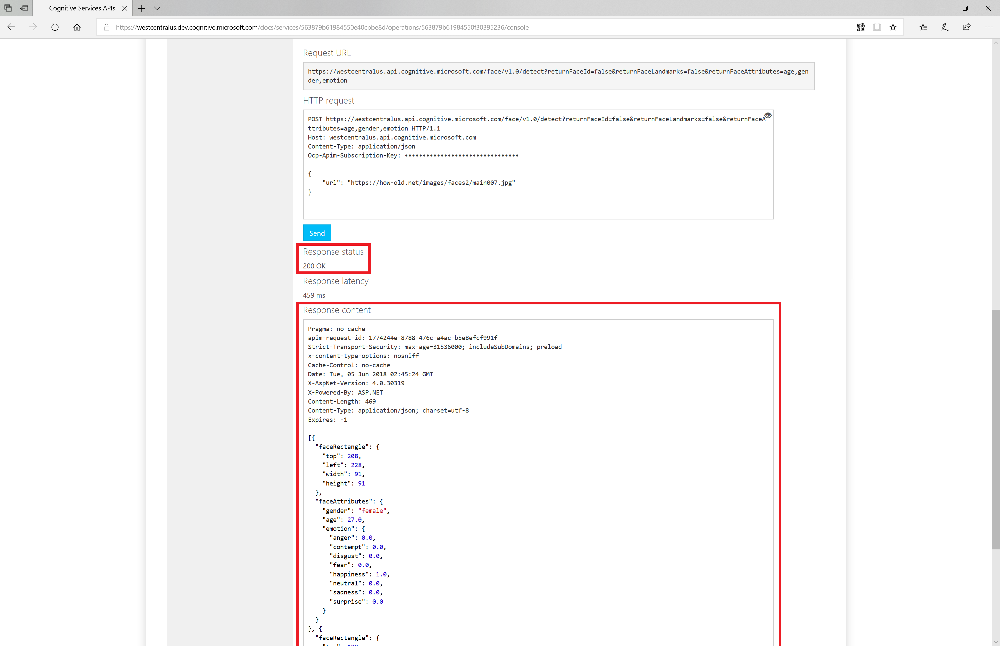  

>**Response status** に「200 OK」と表示されれば、正常にリクエスト送信を行って結果を取得できています。結果は **Response conent** に表示されます。

- 「401 Access Denied」と表示される場合 → サブスクリプションキーを確認してみましょう
- 「400 Bad Request」と表示される場合 → パラメーターや Request Body を確認してみましょう。Request Body で指定したURLの画像 (<https://how-old.net/images/faces2/main007.jpg>) にアクセスできますか？
  

無事 Web API にリクエストを送信して結果を取得できたら、今度は同内容を Postman 経由で実行してみましょう。


#### Postman からの Face API (Detect) の動作確認

8. Postman を起動します。初期ラウンチ画面から [Create New] のタブで [**Request**] をクリックします。
> 初期ラウンチ画面が表示されない場合は、画面左上の [**New**] をクリックして [**Request**] をクリックします。

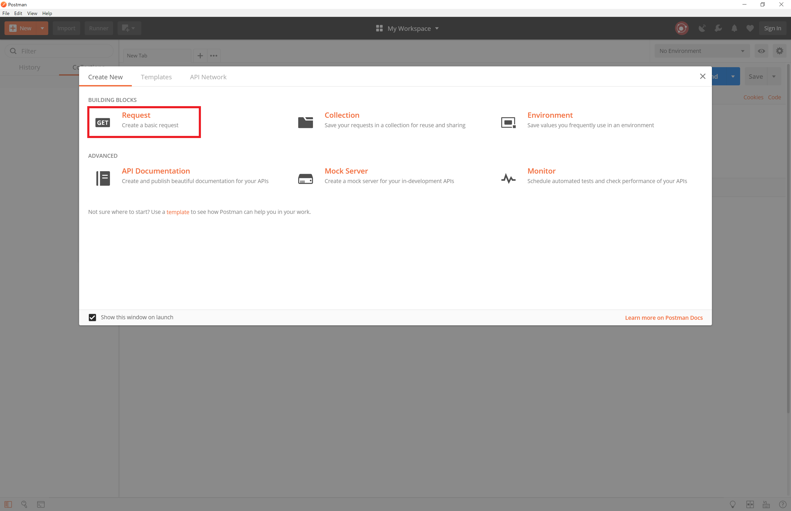  

9. [SAVE REQUEST] 画面で、**Request name** に *Face API - Detect* と入力します。**Select a collection or folder to save to:** の欄では [**Create Collection**] をクリックして、*Cognitive Services* と入力して作成したあと、そのフォルダーを選択します。[**Save**] をクリックして保存します。

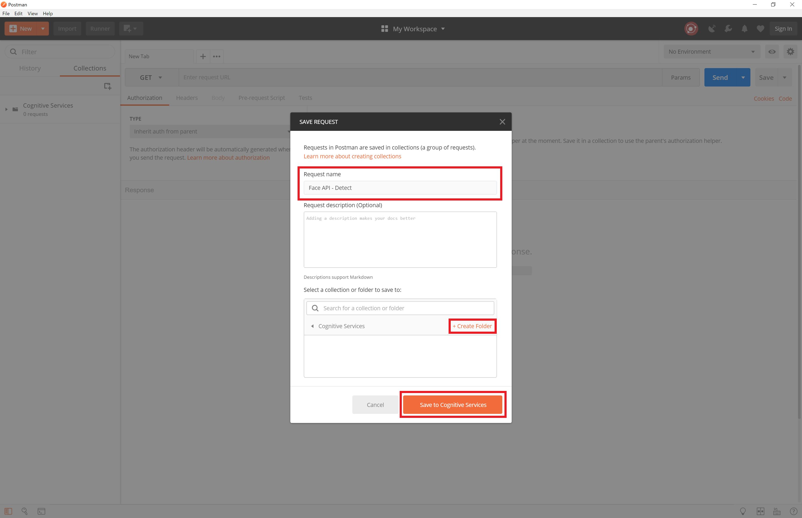  

10. 作成した Face API - Detect の設定画面が表示されます。メソッドを **POST** に設定しておきます。

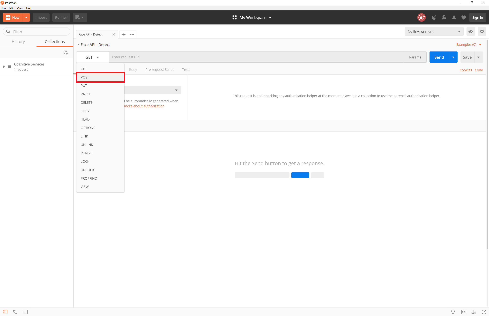  

11. 6 で表示された **Request URL** をコピーし、Postman の設定画面にある [**Enter Request URL**] の欄にペーストします。

**Request URL** (ロケーションが West Central US の場合)
```
https://westcentralus.api.cognitive.microsoft.com/face/v1.0/detect?returnFaceId=false&returnFaceLandmarks=false&returnFaceAttributes=age,gender,emotion
```
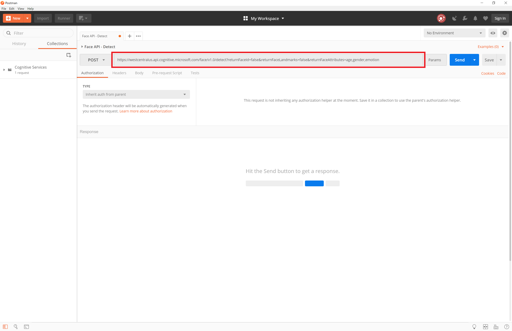  

12. Postman の設定画面で [**Header**] をクリックし、5 で入力した **Header** の情報を入力します。

    - Headers
        - Content-Type : application/json
        - Ocp-Apim-Subscription-Key : Face API キー

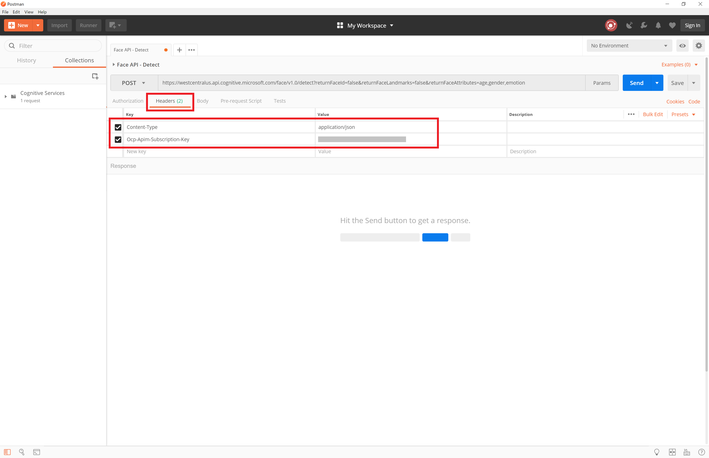  

13. Postman の設定画面で [**Body**] をクリック、[**raw**] を選択して、5 で入力した **Request Body** の情報を入力します。

    - Request Body
        ```
        {
            "url": "https://how-old.net/images/faces2/main007.jpg"
        }
        ```

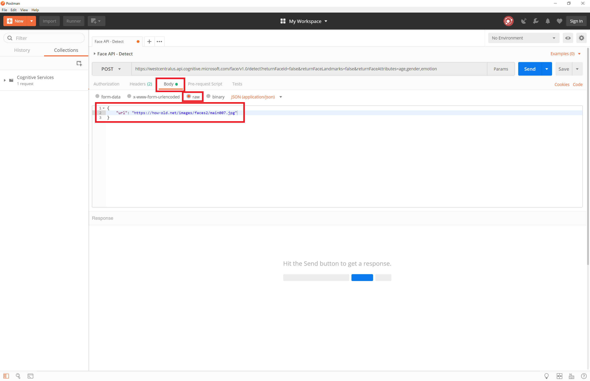  

14. [**Send**] をクリックして、API にリクエストを送信します。「Status: 200 OK」と表示されて結果が表示されれば、正常にリクエスト送信を行って結果を取得できています。

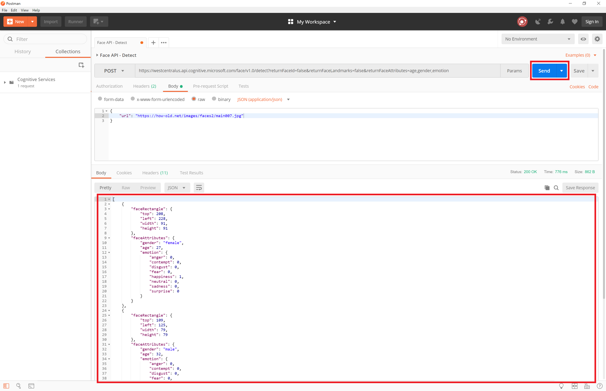  
  

> 以下のように情報を修正すると、PC にある画像ファイルをそのまま API に送信して分析結果を取得できます。
- 12 で設定した Header 情報:   Content-Type → **application/octet-stream** に変更
- 13 で設定した Body 情報: [**binary**] を選択して、[**ファイル選択**]をクリックして PC にある画像ファイル (4MB以下) を選択

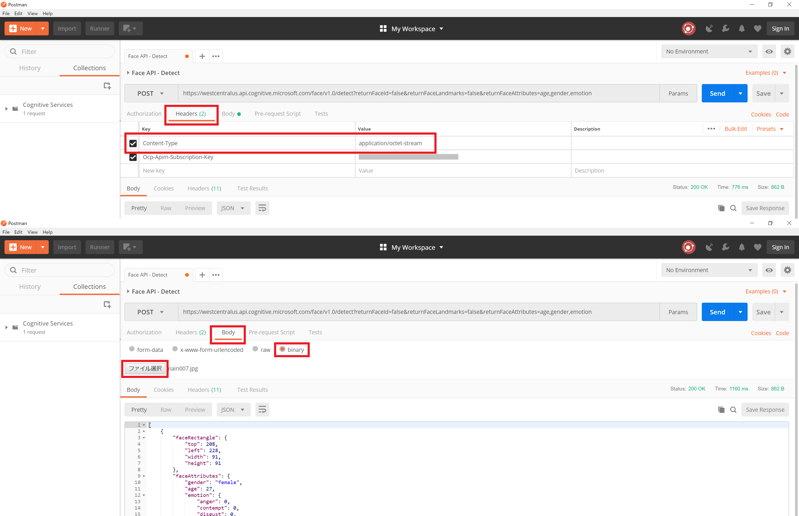  
