# Azure Cognitive Services を活用した Xamarin によるマルチプラットフォームアプリ開発 ハンズオン

## 2. Cognitive Services × Xamarin を利用したスマホ向けアプリの開発ハンズオン

このセクションでは、一つのコードからマルチデバイス(Windows, iOS, Android)で利用できるアプリを開発できる Xamarin をベースとして、 Azure Cognitive Services を利用して画像を分析する、スマホ向けアプリを開発します。  

### 2-1. 新しい Xamarin プロジェクトの作成 と ライブラリのインストール

1. Visual Studio for Mac を起動して、[**ファイル**] > [**新しいプロジェクト**] の順 にクリックします。

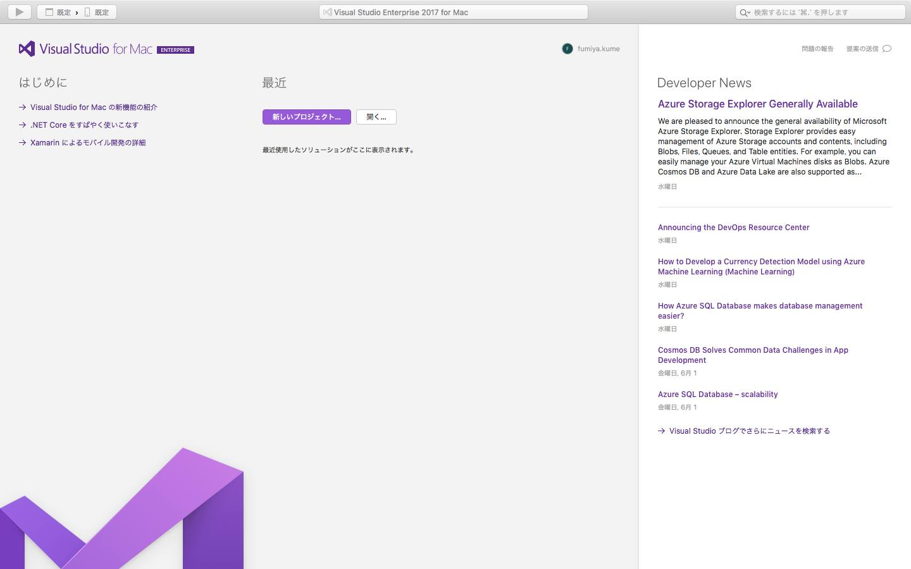  

2. **新しいプロジェクト用のテンプレートを選択する** の画面で、左列のプラットフォームから [**マルチプラットフォーム**] を選択、Xamarin.Forms の [**空白フォームのアプリ**] をクリックして新規プロジェクトを作成します。  

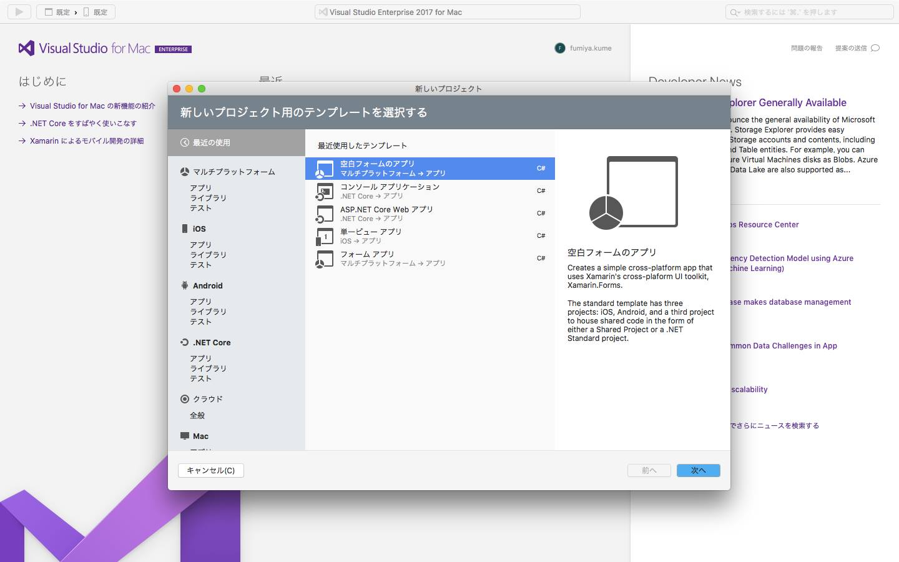  

3. **空白フォームのアプリ の構成** の画面で、**アプリ名** に *CognitiveFaceApp* という名前を入力します。**ターゲットプラットフォーム** は Android と iOS の両方にチェックが入っていることを確認します。 **共有コード** は **Use .NET Standard** を選択します。画面右下の [**次へ**] をクリックします。  

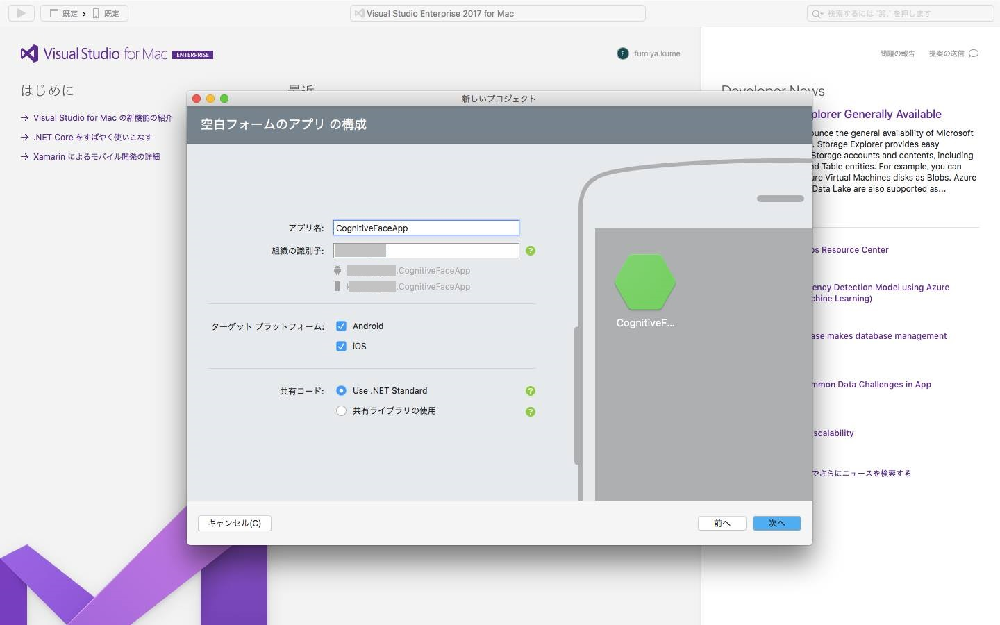  

> Visual Stuio for Mac では iOS および Android 向けプロジェクトが作成できます (UWP は作成できません)。

4. **新しい空白フォームのアプリ の構成** の画面で、**プロジェクト名** に *CognitiveFaceApp* という名前を入力します。**ソリューション名** と **場所** は自動で入力されます。バージョンコントロール、Xamarin Test Cloud はチェックを外しておきます。画面右下の [**作成**] をクリックして、新規プロジェクトを作成します。  

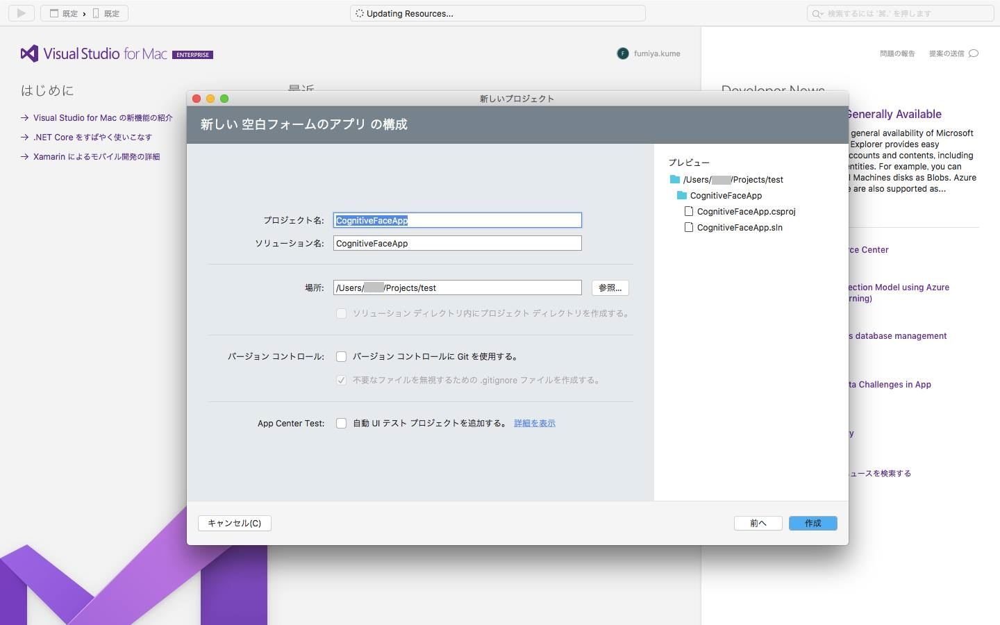  

5. 左列にソリューションが表示され、下部の [パッケージコンソール] に **パッケージは正常に復元されました** と表示されたら、プロジェクトの作成は完了です。

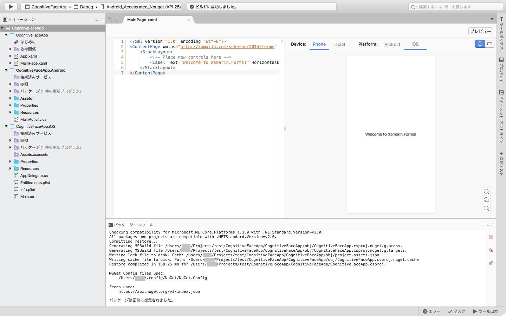  

#### NuGet によるパッケージの管理と Cognitive Services Face API Client Library および 必要なパッケージのインストール  

NuGet は、Microsoft 管理プラットフォーム向けの無料のオープンソース パッケージです。 NuGet では、さまざまなタスクを実行するコードが収録された数千ものライブラリのパ ッケージを利用できます。NuGet は Visual Studio 2017 に統合されており、簡単に NuGet 経由でパッケージをプロジェクトに追加、管理することができます。  

6. 左列の **ソリューション** から、**CognitiveFaceApp.Android** プロジェクトをクリックし、[**パッケージの追加..**] を選択します。  

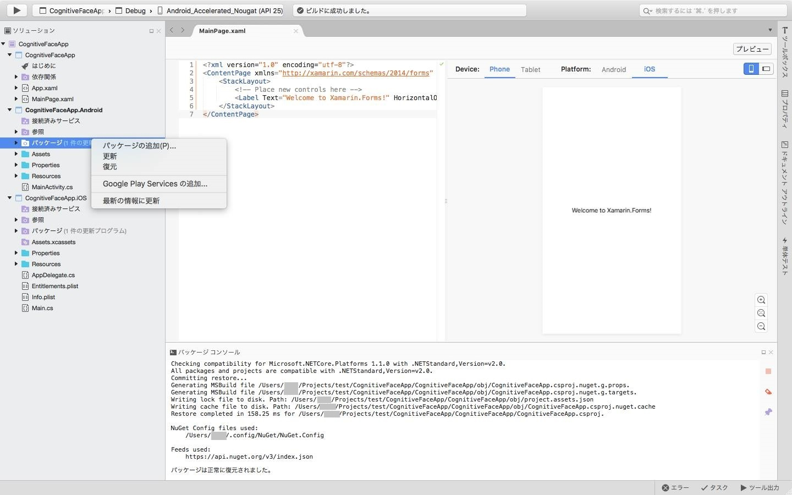  

7. [**パッケージを追加**] 画面で、右上の検索ボックスに *bcl build* と入力して **Microsoft.Bcl.Build** を 探して選択します。画面右列の **バージョン** は **1.0.14** を選択します。画面右下の [**パッケージを追加**] をクリック して、インストールを行います。

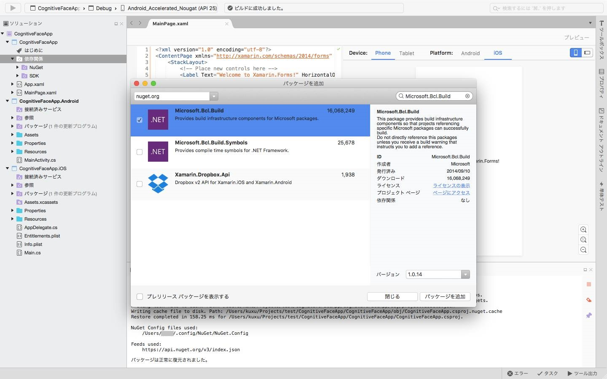  

8. ダウンロードしたパッケージのライセンスへの同意を求められたら [同意する] をクリックして、インストールします。

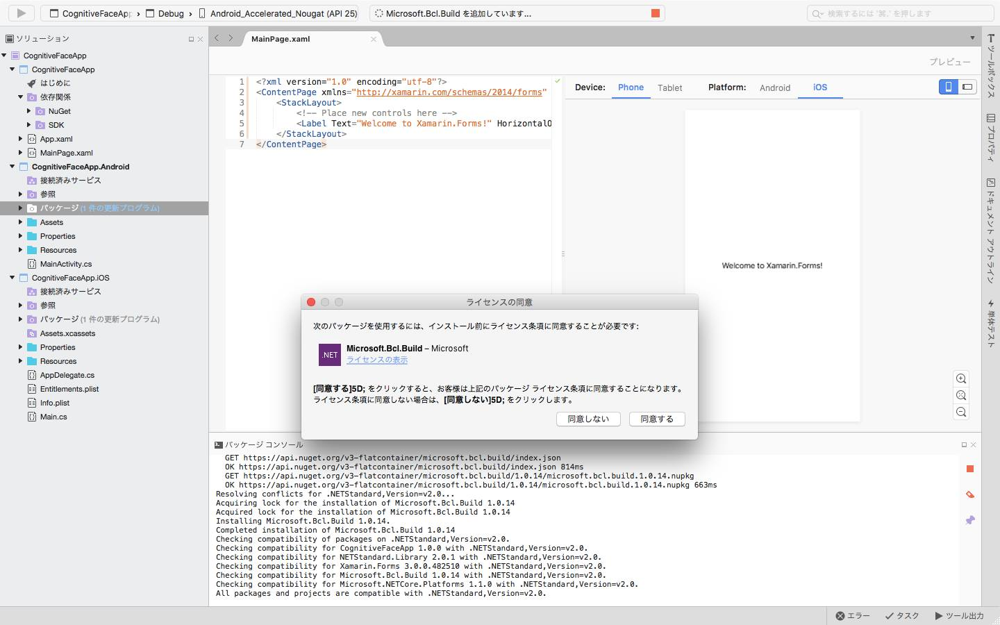  

9. 下部の [パッケージコンソール] に **==========終了==========** と表示されたら、BCL Build のパッケージのインストールは終了です。

10. 同様に、左列の **ソリューション** から、**CognitiveFaceApp.iOS** プロジェクトをクリックし、[**パッケージの追加..**] を選択、**Microsoft.Bcl.Build** をインストールします。

11. 左列の **ソリューション** から、**CognitiveFaceApp** ソリューションの下にある **CognitiveFaceApp** プロジェクトの **依存関係** をクリックして [**パッケージの追加..**] を選択、同様に **Microsoft.Bcl.Build** をインストールします。

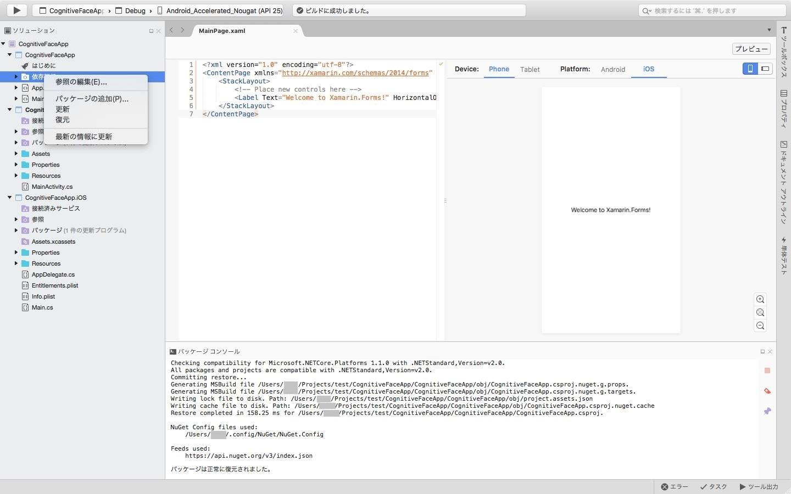  

12. **CognitiveFaceApp** プロジェクト にはさらに 3 種類のパッケージを追加します。[**パッケージの追加**] 画面の検索ボックスに *face* と入力して、**Microsoft.ProjectOxford.Face.DotNetStandard** を探します。バージョンはデフォルトのまま、[**パッケージの追加..**] をクリックして、最新の安定版 のパッケージのインストールを行います。このライブラリには Cognitive Services Face API のヘルパー API が含まれています。

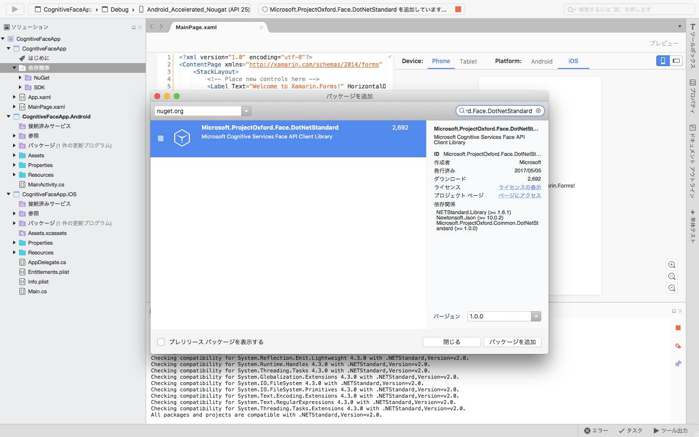  

13. 先ほどと同様に、ライセンスへの同意を求められたら [同意する] をクリックして、インストールします。

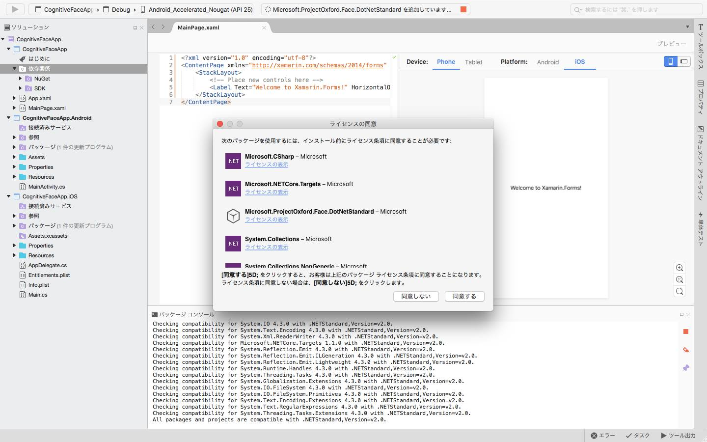  

14. 再び **CognitiveFaceApp** プロジェクトの [**パッケージの追加**] 画面の検索ボックスに、*pcl storage* と入力します。 **PCLExt.FileStorage** を選択して、バージョンはデフォルトのまま、[**パッケージの追加..**] をクリックして、最新の安定版 のパッケージのインストールを行います。このライブラリには、モバイルデバイス内のストレージ(に保存された写真)を利用するための SDK が含まれています。

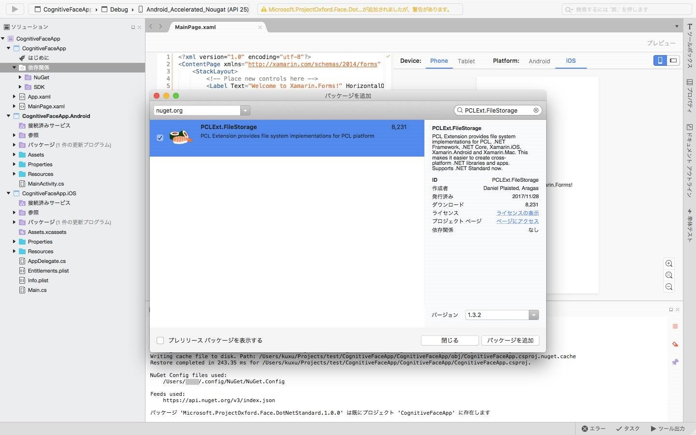  

15. 最後に、**CognitiveFaceApp** プロジェクトの [**パッケージの追加**] 画面の検索ボックスに、*xam media* と入力します。 **Xam.Plugin.Media** を選択して、バージョンはデフォルトのまま、[**パッケージの追加..**] をクリックして、最新の安定版 のパッケージのインストールを行います。このライブラリには、モバイルデバイスのカメラやマイクを利用するための SDK が含まれています。

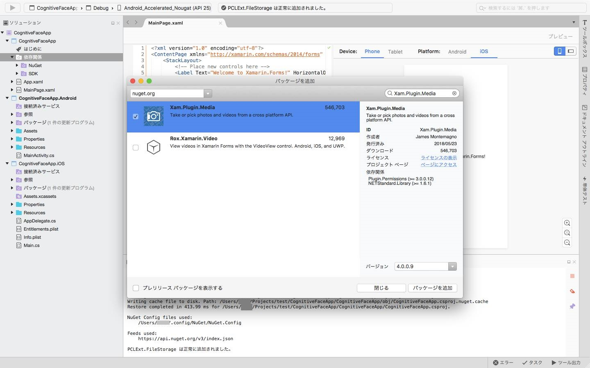  

15. Xam.Plugin.Media のインストール後、これを利用するためのガイドが表示されます。以下の手順で 各デバイス向けの設定を行います。

  

#### iOS 向け設定

16. 左列の **ソリューション** から **CognitiveFaceApp.iOS** の下にある **info.plist** をクリックして開きます。


17. `<dict>` と `</dict>` の間 (`</dict>` の直前) に、iOS向けプライバシーポリシーの設定を追加します。

```
  <key>NSCameraUsageDescription</key>
  <string>This app needs access to the camera to take photos.</string>
  <key>NSPhotoLibraryUsageDescription</key>
  <string>This app needs access to photos.</string>
  <key>NSMicrophoneUsageDescription</key>
  <string>This app needs access to microphone.</string>
  <key>NSPhotoLibraryAddUsageDescription</key>
  <string>This app needs access to the photo gallery.</string>
```

19. [ファイル] > [すべて保存] をクリックして、すべての変更を保存しておきます。
