# Azure Cognitive Services を活用した Xamarin によるマルチプラットフォームアプリ開発 ハンズオン

## 2. Cognitive Services × Xamarin を利用したスマホ向けアプリの開発ハンズオン

このセクションでは、一つのコードからマルチデバイス(Windows, iOS, Android)で利用できるアプリを開発できる Xamarin をベースとして、 Azure Cognitive Services を利用して画像を分析する、スマホ向けアプリを開発します。  

### 2-1. 新しい Xamarin プロジェクトの作成 と ライブラリーのインストール

1. Visual Studio 2017 を起動して、[**ファイル**] > [**新規作成**] ＞ [**プロジェクト**] の順 にクリックします。

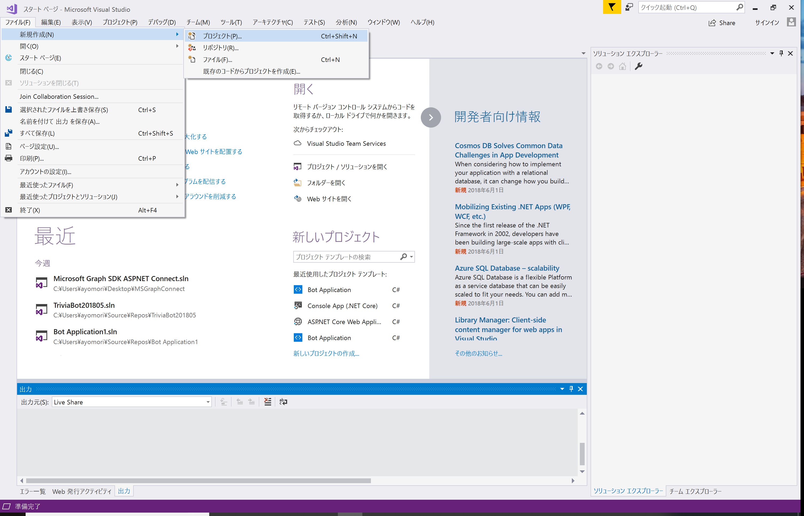  

2. **新しいプロジェクト** の画面で、左列から **Visual C#** > **Cross Platform** を選択、 中央のパネルから **Mobile App (Xamarin.Forms)** を選択します。画面下列の **名前** の欄に *CognitiveFaceApp* という名前を入力し、[**OK**] をクリックして新規プロジェクトを 作成します。  

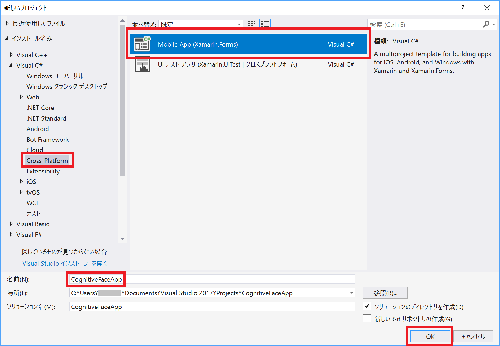  

3. **New Cross Platform App** の画面で、**Select a template** (テンプレートの選択) から、**Blank App**(空のアプリ) を選択 します。**Platform** は **Windows (UWP)** にチェックが入っていることを確認します。**Code Shareing Strategy** は **.NET Standard** を選択します。画面右下の [**OK**] をクリックします。  

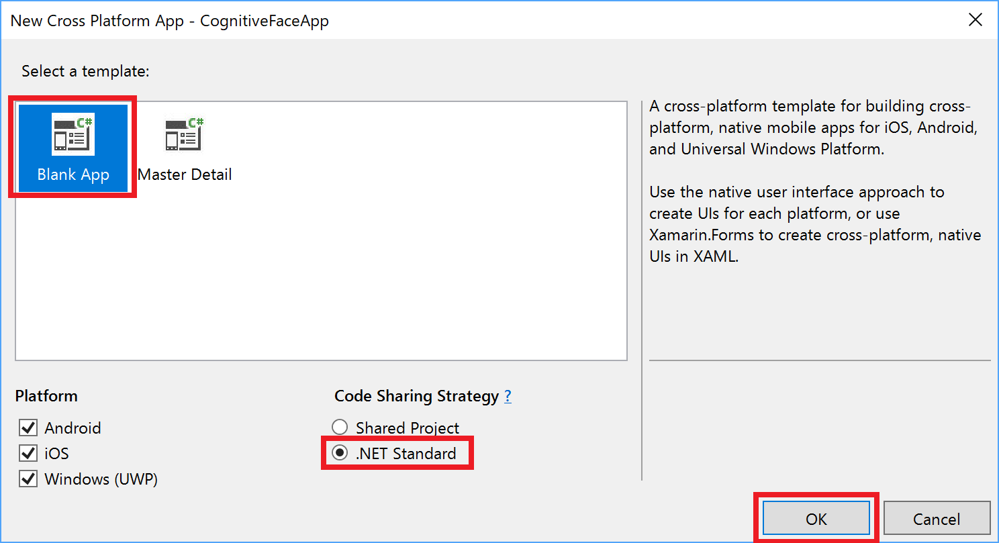  

4. *要確認* ユニバーサル Windows アプリケーションがサポートする、既定のターゲット バージ ョンと最小バージョンを確認し、[**OK**] をクリックします。  

#### NuGet によるパッケージの管理と Cognitive Services Face API Client Library および 必要なパッケージのインストール  

NuGet は、Microsoft 管理プラットフォーム向けの無料のオープンソース パッケージです。 NuGet では、さまざまなタスクを実行するコードが収録された数千ものライブラリーのパ ッケージを利用できます。NuGet は Visual Studio 2017 に統合されており、簡単に NuGet 経由でパッケージをプロジェクトに追加、管理することができます。  

5. [ソリューションエクスプローラー] ウィンドウで、**ソリューション 'CognitiveFaceApp'** を右クリックし、[**NuGet パッケージの復元**] を選択、プロジェクトに含まれていないパッケージを復元します。  

6. [出力] ウィンドウに **==========終了==========** と表示されたらパッケージの復元は完了です。

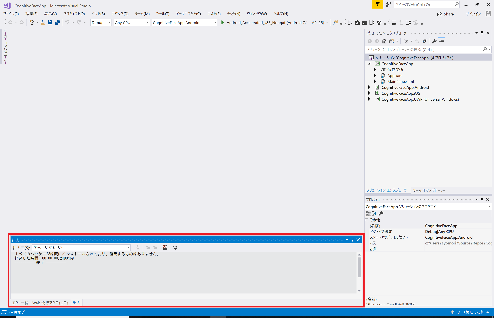

7. [ソリューションエクスプローラー] ウィンドウで、再度 **ソリューション 'CognitiveFaceApp'** を右クリックし、[**NuGet パッケージの管理..**] を選択します。  

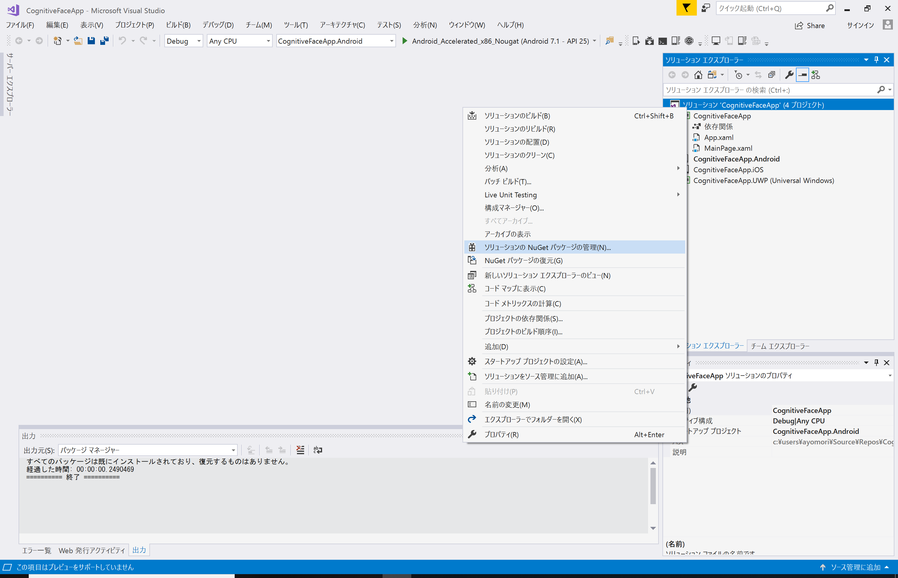

8. [**参照**] タブをクリックします。検索ボックスに *bcl build* と入力して **Microsoft.Bcl.Build** を 探して選択します。すべてのプロジェクトに チェック ✓ をつけ、[**インストール**] をクリック して、最新の安定版 のパッケージのインストールを行います。

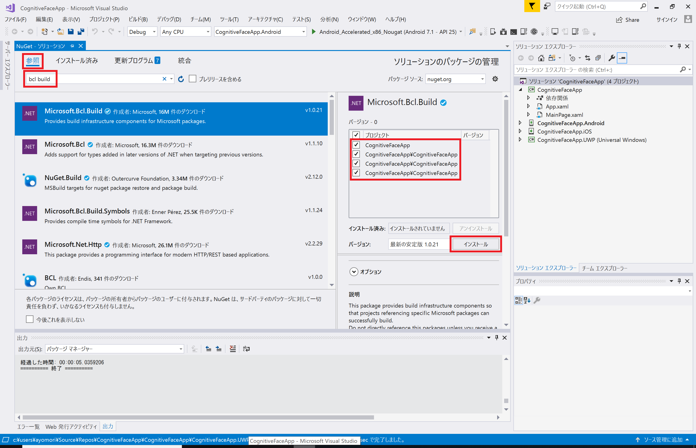

9. 変更の確認を求められたら [OK] をクリックして進みます。ダウンロードしたパッケージのライセンスへの同意を求められたら [同意する] をクリックして、インストールします。

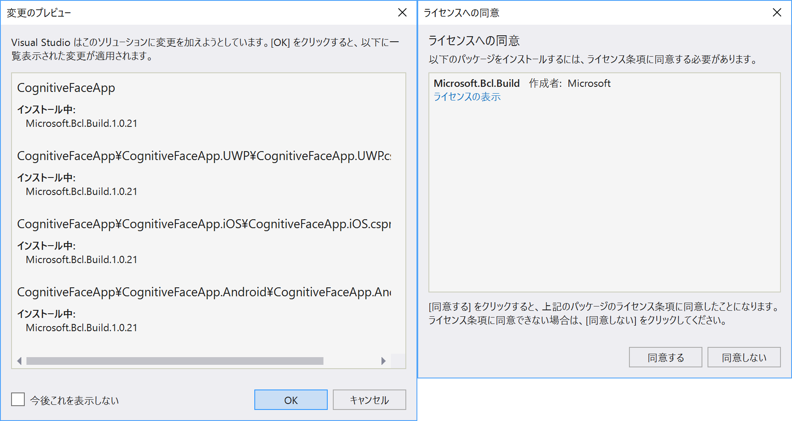

10. [出力] ウィンドウに **==========終了==========** と表示されたら、BCL Build のパッケージのインストールは終了です。

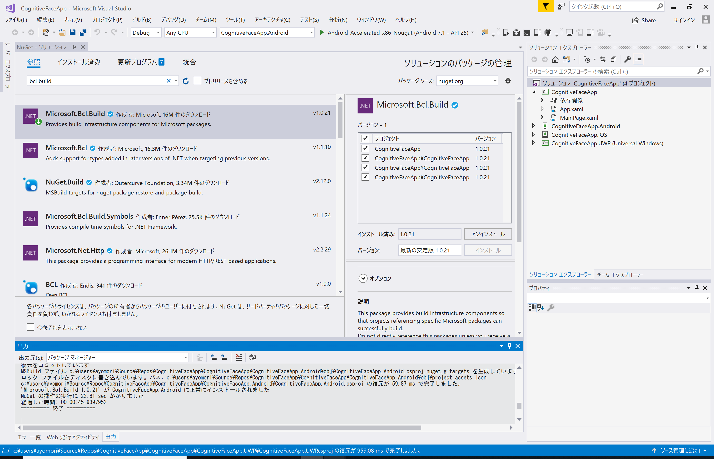

11. 次に、 [参照] タブの検索ボックスに、*face* と入力します。 **Microsoft.ProjectOxford.Face.DotNetStandard** を選択して、**CognitiveFaceApp のプロジェクトのみ** に チェック ✓ をつけます。[**インストール**] をクリックして、最新の安定版 のパッケージのインストールを行います。このライブラリーには Cognitive Services Face API のヘルパー API が含まれています。

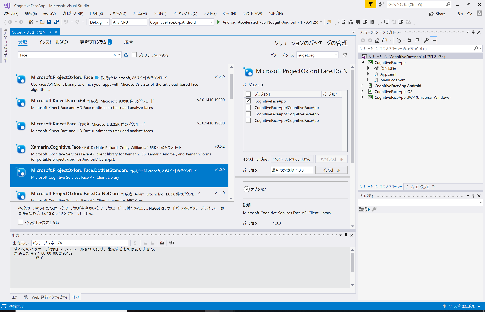

12. 先ほどと同様に、変更の確認に [OK] をクリック、パッケージのライセンスに [同意] をクリックしてインストールします。

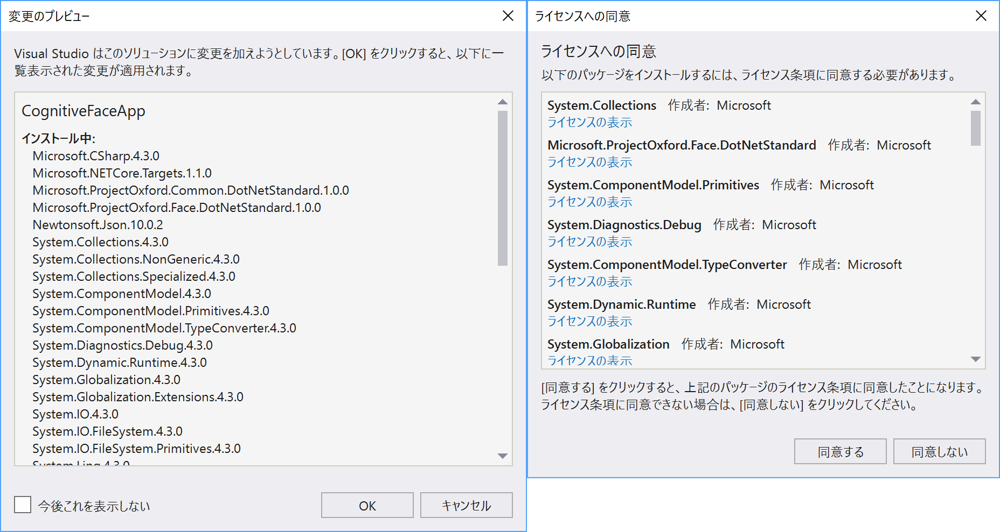

13. 今度は、[参照] タブの検索ボックスに、*pcl storage* と入力します。 **PCLExt.FileStorage** を選択して、**CognitiveFaceApp のプロジェクトのみ** に チェック ✓ をつけます。[**インストール**] をクリックして、最新の安定版 のパッケージをインストールします。このライブラリーには、モバイルデバイス内のストレージ(に保存された写真)を利用するための SDK が含まれています。

14. 最後に、[参照] タブの検索ボックスに、*xam media* と入力します。 **Xam.Plugin.Media** を選択して、**CognitiveFaceApp のプロジェクトのみ** に チェック ✓ をつけます。[**インストール**] をクリックして、最新の安定版 のパッケージをインストールします。このライブラリーには、モバイルデバイスのカメラやマイクを利用するための SDK が含まれています。

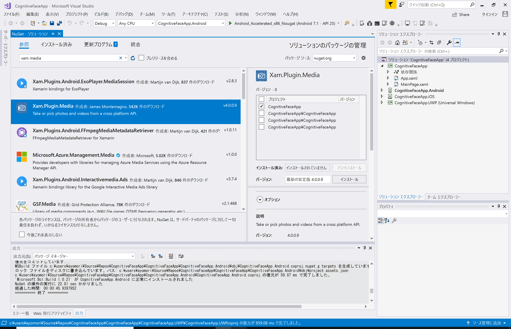

15. Xam.Plugin.Media のインストール後、これを利用するためのガイドが表示されます。以下の手順で 各デバイス向けの設定を行います。

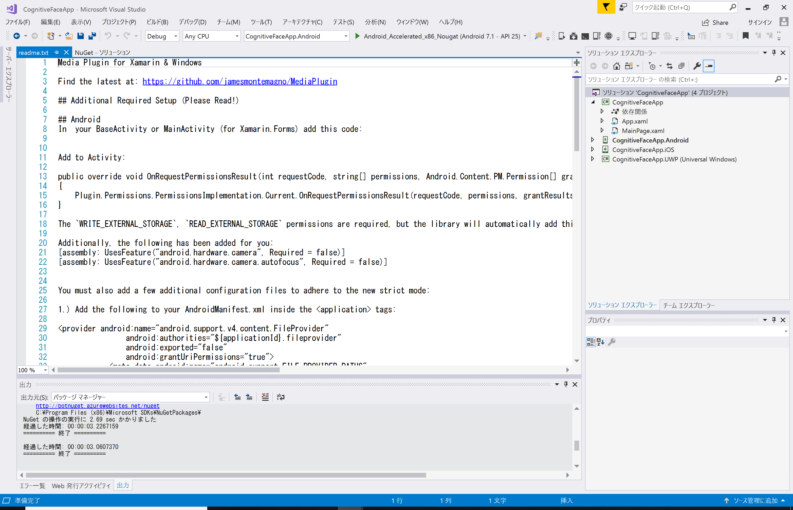

#### Windows (UWP) 向け設定

16. ソリューションエクスプローラーで **CognitiveFaceApp.UWP (Uiversal Windows)** というプロジェクトを右クリックし、スタートアッププロジェクトに設定 をクリックして設定します。

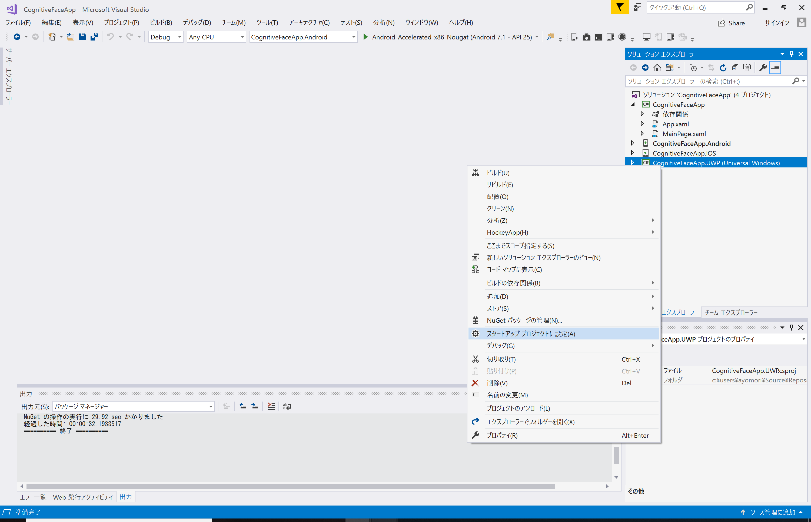

17. ソリューションエクスプローラーで **CognitiveFaceApp.UWP (Uiversal Windows)** プロジェクトの中にある **Package.appxmanifest** をダブルクリックして開きます。

18. Package.appxmanifest の [**機能**] タブをクリックします。**Web カメラ** にチェック ✓ をつけます。

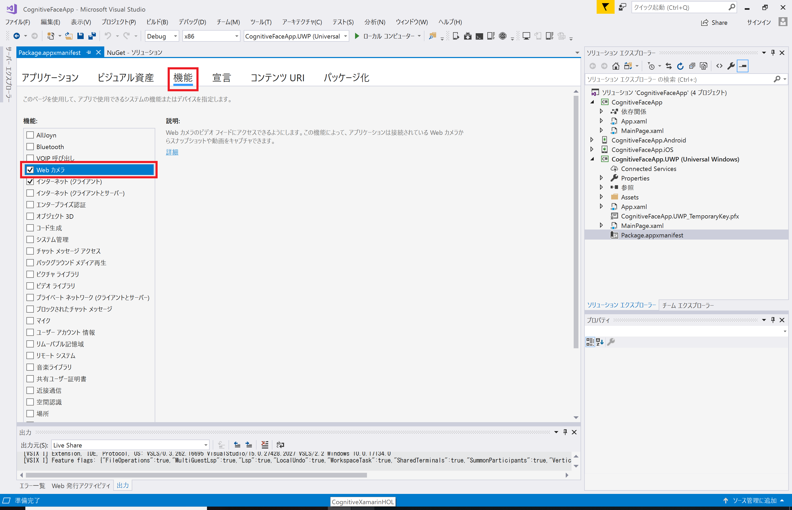

19. [ファイル] > [すべて保存] をクリックして、すべての変更を保存しておきます。

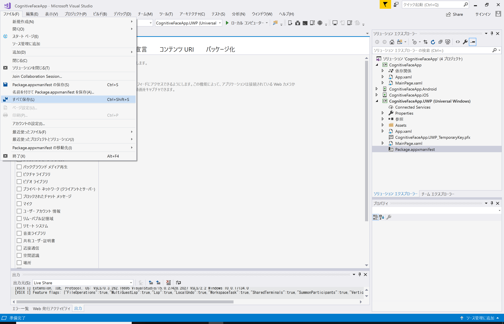 