# Azure Cognitive Services を活用した Xamarin によるマルチプラットフォームアプリ開発 ハンズオン

## 2. Cognitive Services × Xamarin を利用したスマホ向けアプリの開発ハンズオン

このセクションでは、一つのコードからマルチデバイス(Windows, iOS, Android)で利用できるアプリを開発できる Xamarin をベースとして、 Azure Cognitive Services を利用して画像を分析する、スマホ向けアプリを開発します。  

### 2-2. Xamarin.Forms を利用した マルチデバイス向けアプリの作成

1. [**ソリューションエクスプローラー**] ウインドウで **CognitiveFaceApp** プロジェクトを開きます。こちらは、Windows、iOS、Android の各デバイスに共通して使われるコードを記述します。  
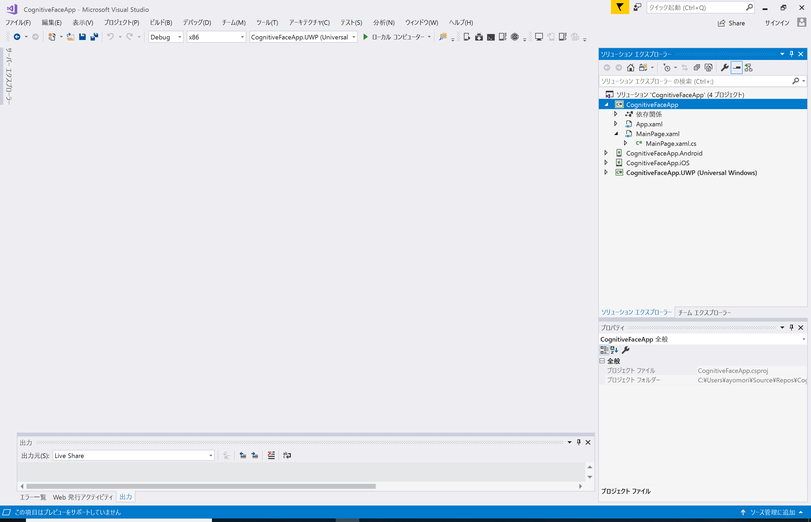
  

#### 2-2-1. アプリ表示画面 (MainPage.xaml) のコーディング

2. **CognitiveFaceApp** プロジェクトの中にある **MainPage.xaml** をクリックして開きます。  
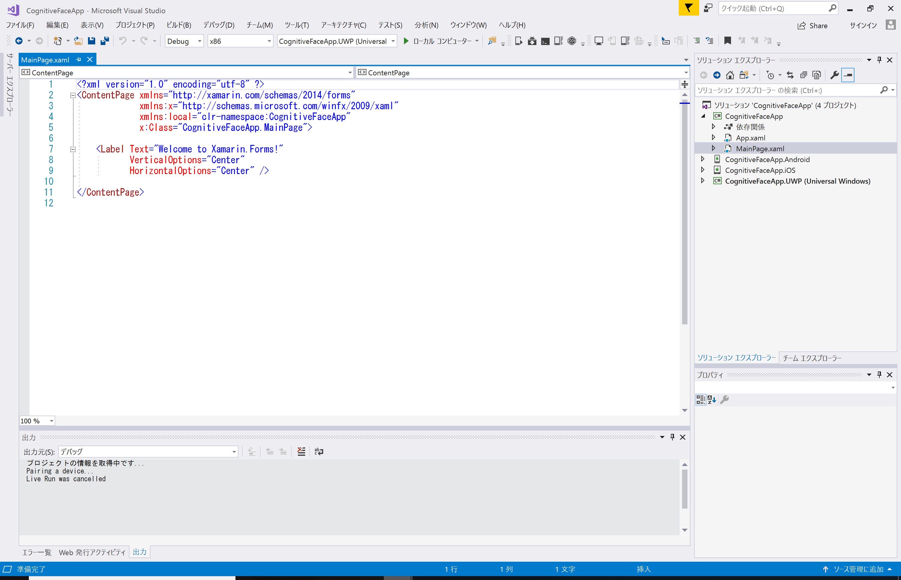

3. `<ContentPage ...>` と `</Contentpage>` を以下のコード(ContentPage.Content 要素)に書き換えます。このコードでは、写真を表示するグリッド、2 種類の操作ボタン (写真の選択、リセット)、および 判 定した年齢、性別、感情を表示するラベルを作成します。
```
<ContentPage.Content>
        <StackLayout>
            <Grid>
                <Grid.RowDefinitions>
                    <RowDefinition Height="*" />
                    <RowDefinition Height="Auto" />
                    <RowDefinition Height="Auto" />
                </Grid.RowDefinitions>
                <Image x:Name="ImagePreview" Grid.Row="0" HorizontalOptions="Center"/>
                <Button Grid.Row="1" Text="写真の選択" />
                <Button Grid.Row="2" Text="リセット" />

                <StackLayout Grid.Row="3" HorizontalOptions="Center">
                    <Label x:Name="Age">年齢</Label>
                    <Label x:Name="Gender">性別</Label>
                    <Label x:Name="Smile">笑顔</Label>
                </StackLayout>
            </Grid>
        </StackLayout>
    </ContentPage.Content>
```  
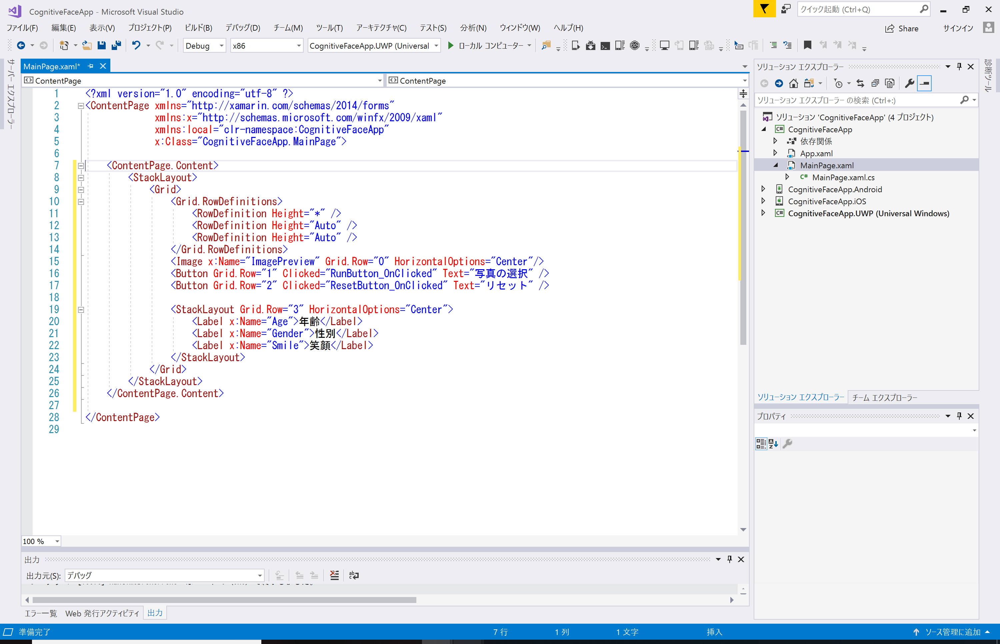

4. ここで、作成した画面を確認します。上部ツールバーで、実行環境を [**Debug**] [**x86**] [**CognitiveFaceApp.UWP**] となっていることを確認し、[**ローカルコンピューター**] をクリックしてデバック実行を行います。  
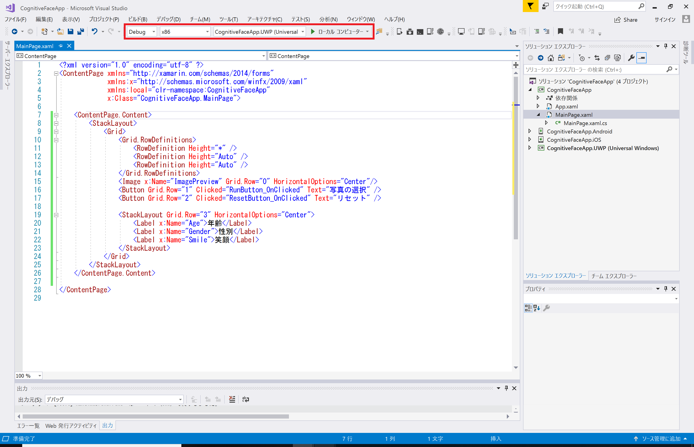

5. アプリのビルドが実行されたのち(初回は時間がかかります)、アプリのデバッグ実行が始まります。アプリのウインドウが起動します。画像や分析結果を表示する領域やボタンが以下のように表示されます。  
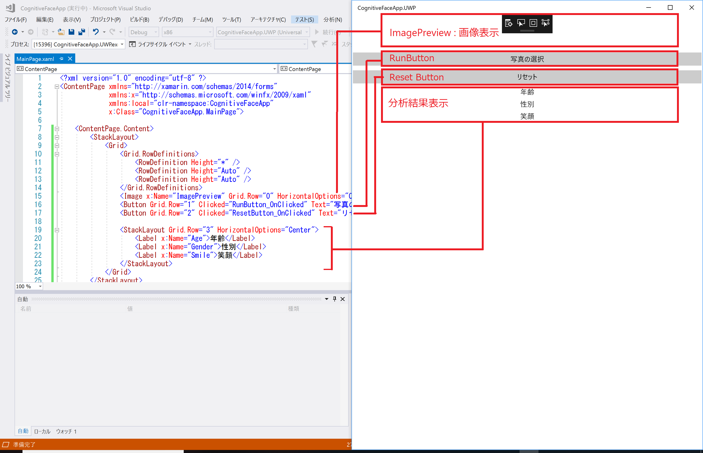

6. アプリのウインドウを閉じ、Visual Studio の上部ツールバーから [デバッグの停止] をクリックして、デバッグを終了します。  
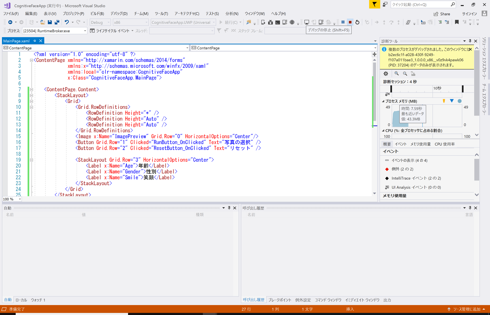

```
7. [写真の選択] ボタン、および [リセット] ボタンが押される動作を取得するため、それぞれのボタンに Clicked イベントハンドラーを追加します。
<Button Grid.Row="1" Clicked="RunButton_OnClicked" Text="写真の選択" />
<Button Grid.Row="2" Clicked="ResetButton_OnClicked" Text="リセット" />
```


>MainPage.xaml で使用されているのは Extensible Application Markup Language (XAML) です。XAML は、ユーザー インターフェイスの構築用にマイクロソフトが作成した言語です。XAML を Xamarin Forms と組み合わせて、また、ユニバーサル Windows ア プリ、iOS、Android 向けのユーザー インターフェイスの構築にも使用できます。 XAML は、Visual Studio やその他のよく使用されているデザインツールから利用できます。
  

#### 2-2-2. アプリ実行部分 (MainPage.xaml.cs) のコーディング

8. [**ソリューションエクスプローラー**] ウィンドウから、**MainPage.xaml.cs** を開きます。  
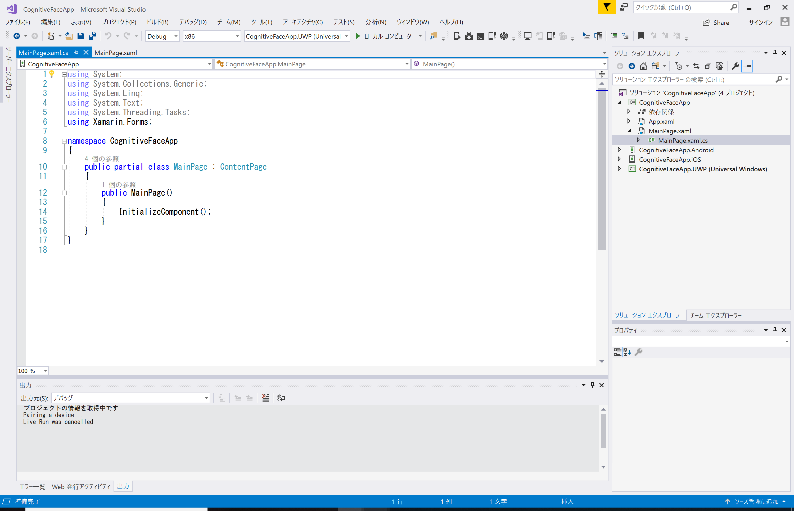

9. ページの上部に既にある using ステートメントに、以下の using ステートメントを追加し、インストールしたライブラリーが利用できるようにします。  
```
using Microsoft.ProjectOxford.Face;
using Plugin.Media;
using Plugin.Media.Abstractions;
using PCLExt.FileStorage;
using PCLExt.FileStorage.Files;
```  
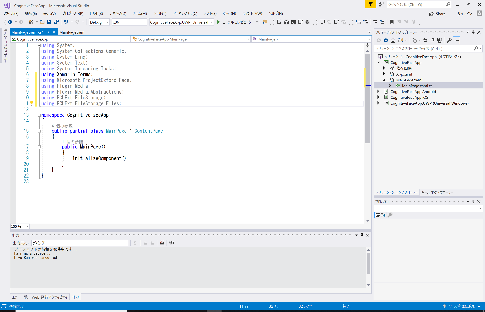

10. `MainPage.xaml.cs` の `MainPage : Content Page` の中にアプリの実行部分のコードを追加していきます。まずはデバイスで写真を撮る `TakePhotoAsync` と デバイスに保存された写真を選択する `PiclPhotoAsync` を追加します。
```
public static async Task<string> TakePhotoAsync()
{

}
public static async Task<string> PickPhotoAsync()
{

}
```   
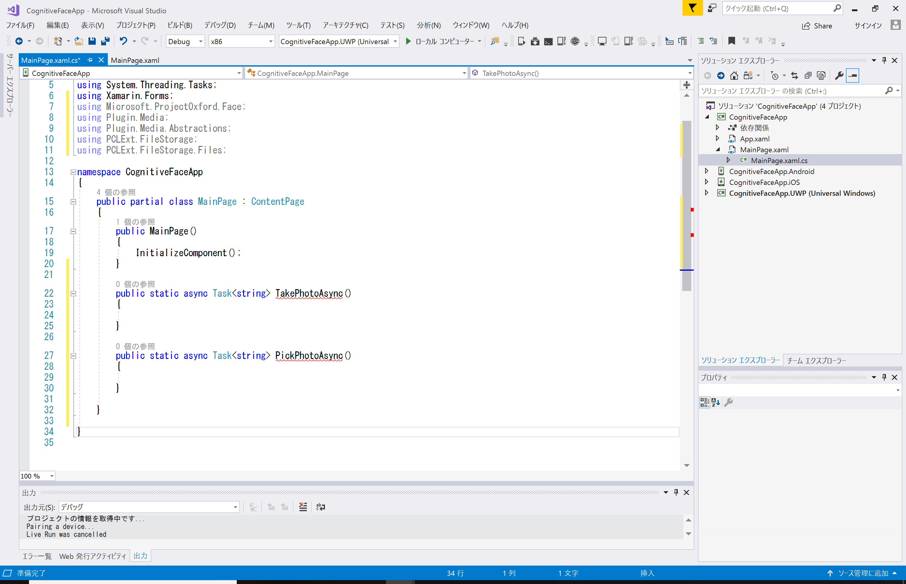  

11. `TakePhotoAsync` と `PickPhotoAsync` の実行コードを以下のように記述します。  
```
public static async Task<string> TakePhotoAsync()
{
    // カメラを初期化
    await CrossMedia.Current.Initialize();

    // カメラを使えるかどうか判定
    if (!CrossMedia.Current.IsCameraAvailable || !CrossMedia.Current.IsTakePhotoSupported)
    {
        throw new NotSupportedException("カメラをアプリから利用できるように設定してください");
    }

    // 撮影し、保存したファイルを取得
    var photo = await CrossMedia.Current.TakePhotoAsync(new StoreCameraMediaOptions());

    // 保存したファイルのパスを取得
    return photo.Path;
}
```
```
public static async Task<string> PickPhotoAsync()
{
    // ローカルフォルダーから写真を選択させる
    var photo = await CrossMedia.Current.PickPhotoAsync();

    // 保存したファイルのパスを取得
    return photo.Path;
}
```  
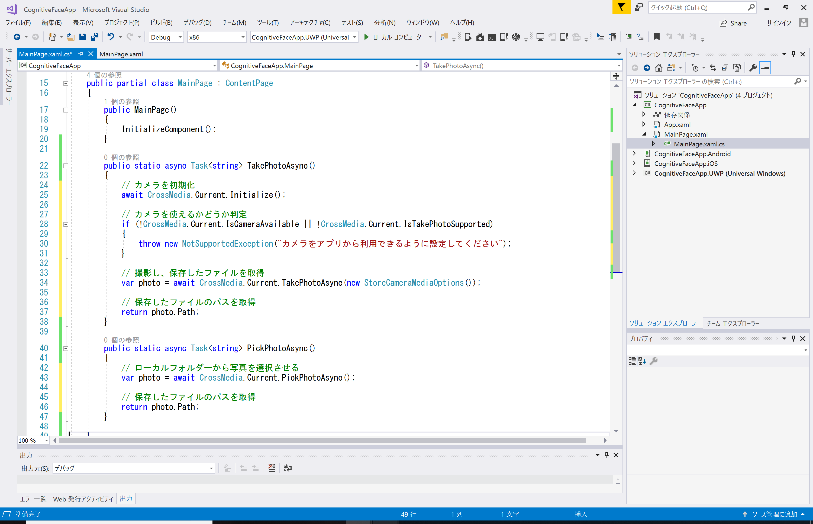  

12. 今度は Cognitive Services Face API を呼び出して写真判定を実行するコードを追加していきます。まずは Face API から得られる分析データを格納する `FaceDetectResult` クラスを、`MainPage : Content Page` の中に作成します。  
```
public class FaceDetectResult
{
    public double Age { get; set; }
    public string Gender { get; set; }
    public double Smile { get; set; }
}
```   
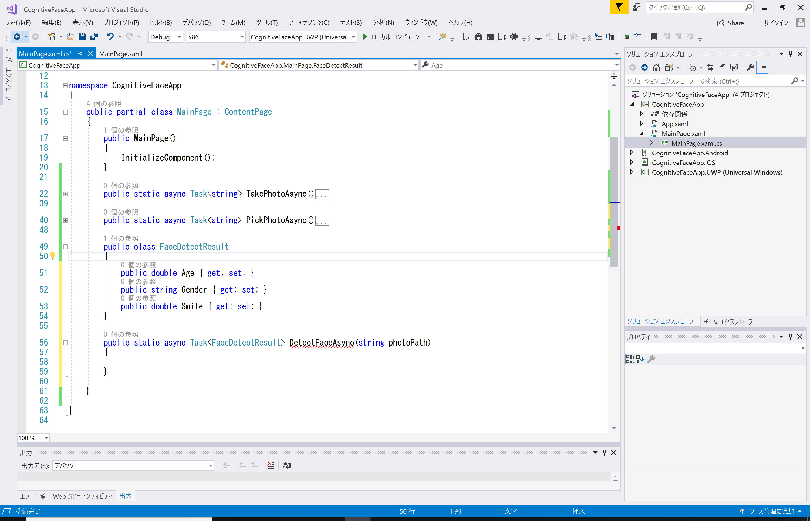  

13. 同様に、Face API を呼び出して分析データを取得する `DetectFaceAsync` を `MainPage : Content Page` の中に作成し、以下のように記述します。コード内にある YOUR_API_KEY および YOUR_API_LOCATION は、1-2 で利用した API キー およびロケーションに置き換えます。 
```
public static async Task<FaceDetectResult> DetectFaceAsync(string photoPath)
{
    // Face API 呼び出し準備
    var apiKey = "YOUR_API_KEY";
    var apiEndPoint = "https://YOUR_API_LOCATION.api.cognitive.microsoft.com/face/v1.0";
    var client = new FaceServiceClient(apiKey, apiEndPoint);

    // Face API で判定
    var file = new FileFromPath(photoPath);
    var imageStream = file.Open(FileAccess.Read);

    var attributes = new FaceAttributeType[] {
        FaceAttributeType.Age,FaceAttributeType.Gender,FaceAttributeType.Smile,
    };
    var result = await client.DetectAsync(imageStream, false, false, attributes);

    // 判定結果を代入
    var detectResult = new FaceDetectResult();

    detectResult.Age = result[0].FaceAttributes.Age;
    detectResult.Gender = result[0].FaceAttributes.Gender;
    detectResult.Smile = result[0].FaceAttributes.Smile;

    return detectResult;
}
```  
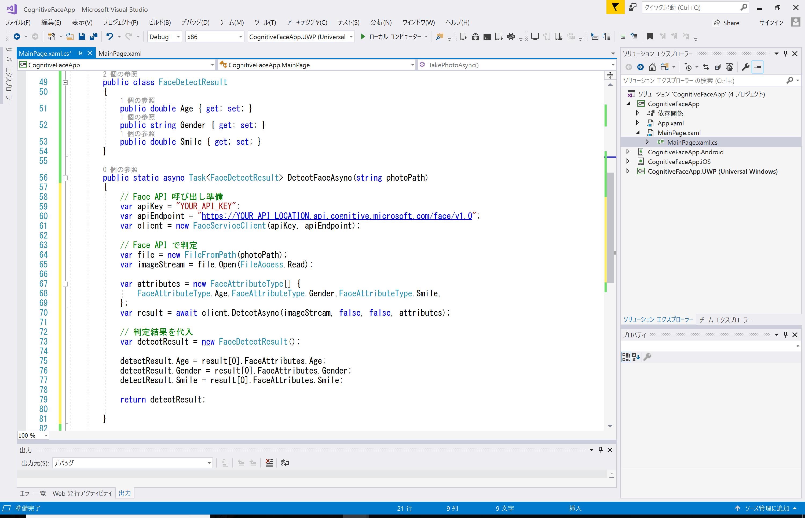  
  
13. 最後に画面上のボタンを押したときの動作を追加します。RunButton を押したときの動作である `RunButton_OnClicked`、および ResetButton を押したときの動作 `ResetButton_OnClicked` を `MainPage : Content Page` の中に作成します。  
```
private async void RunButton_OnClicked(object sender, EventArgs e)
{

}

private async void ResetButton_OnClicked(object sender, EventArgs e)
{

}
```  
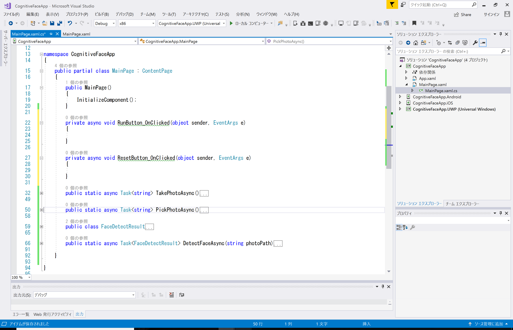  

14. `RunButton_OnClicked` は以下のように記述します。  
```
private async void RunButton_OnClicked(object sender, EventArgs e)
{
    // 画像の選択
    var photo = "";
    var imageChoiceResult = await DisplayAlert("どちらの画像を使いますか", "", "カメラ", "ローカルフォルダー");

    if (imageChoiceResult)
    {
        photo = await TakePhotoAsync();
    }
    else
    {
        photo = await PickPhotoAsync();
    }

    // 画像の判定
    ImagePreview.Source = photo;
    var faceResult = new FaceDetectResult();

    faceResult = await DetectFaceAsync(photo);

    // 判定結果を配置
    Age.Text = "年齢 : " + faceResult.Age;
    Gender.Text = "性別 : " + faceResult.Gender;
    Smile.Text = "笑顔 : " + (faceResult.Smile * 100).ToString("##0") + "点";

}
```  
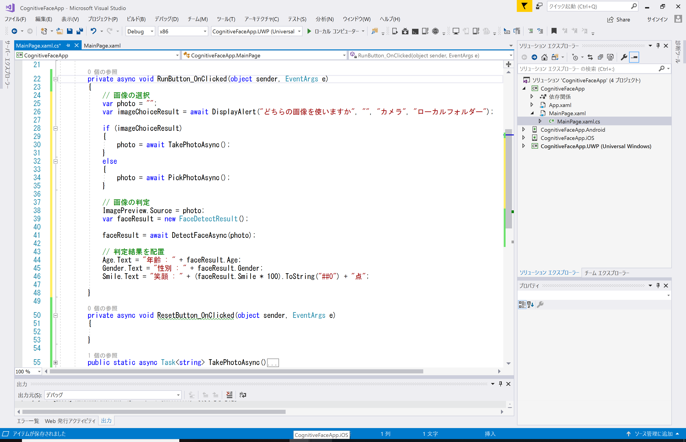  

15. `RunButton_OnClicked` では `EventArgs` というエラーを検出する変数を利用できます。画像の操作や、APIの利用時にエラーが発生した場合にエラーメッセージを表示するコードを追加します。追加した `RunButton_OnClicked`は以下のようになります。   
```
private async void RunButton_OnClicked(object sender, EventArgs e)
{
    // 画像の選択
    var photo = "";
    var imageChoiceResult = await DisplayAlert("どちらの画像を使いますか", "", "カメラ", "ローカルフォルダー");

    try
    {
        if (imageChoiceResult)
        {
            photo = await TakePhotoAsync();
        }
        else
        {
            photo = await PickPhotoAsync();
        }
    }
    catch (Exception exception)
    {
        await DisplayAlert("エラーが発生しました", exception.Message, "OK");
    }

    // 画像の判定
    ImagePreview.Source = photo;
    var faceResult = new FaceDetectResult();

    try
    {
        faceResult = await DetectFaceAsync(photo);
    }
    catch (Exception exception)
    {
        await DisplayAlert("Face API の呼び出しに失敗しました", exception.Message, "OK");
        return;
    }

    // 判定結果を配置
    Age.Text = "年齢 : " + faceResult.Age;
    Gender.Text = "性別 : " + faceResult.Gender;
    Smile.Text = "笑顔 : " + (faceResult.Smile * 100).ToString("##0") + "点";

}
```  
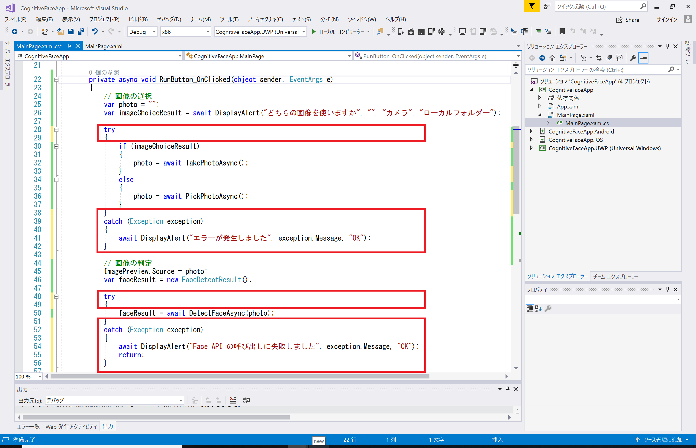  

16. `RunButton_OnClicked` は以下のように記述します。  
```
private async void ResetButton_OnClicked(object sender, EventArgs e)
{
    ImagePreview.Source = null;

    Age.Text = "年齢";
    Gender.Text = "性別";
    Smile.Text = "笑顔";
}
```  
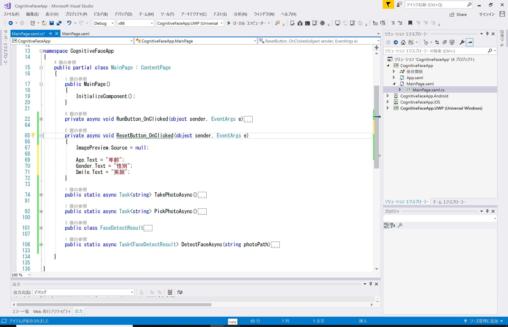  

以上で実装は終了です。

#### 2-2-3. 動作確認

17. Visual Studio 上部ツールバーから [**ローカルコンピューター**] をクリックしてデバック実行を行います。アプリが起動したら、カメラまたは保存してある画像を使って分析を行います。
- カメラで写真を撮影することができますか？
- デバイスに保存している写真を利用することができますか？
- カメラで撮影、または保存している写真を選択して [写真の分析] をクリックすると、画像の分析結果が表示されますか？
- [リセット] をクリックすると、分析データのない画面にリセットされますか？
  
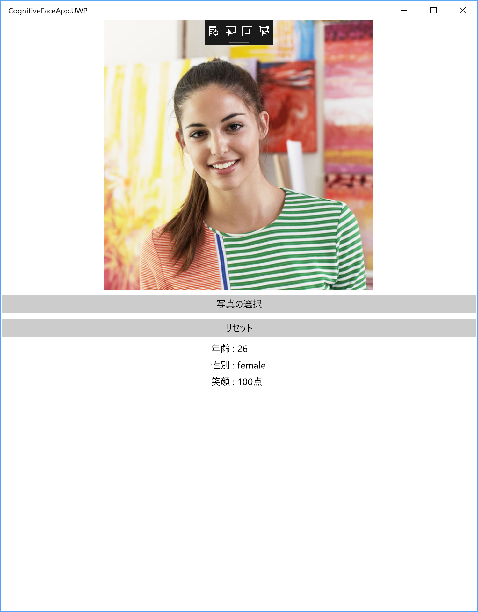  

以上の動作を確認できれば、アプリ開発は終了です。
